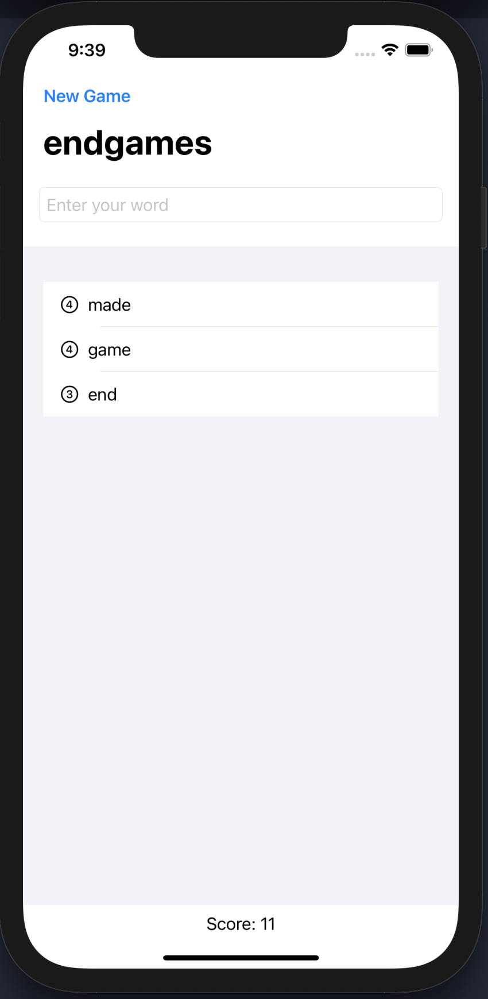

# 100-Days-of-SwiftUI
This repository contains the projects of the 100 Days Of SwiftUI by Paul Hudson.

  

| # | Project         | Topics Covered | Preview | Description |
| - | --------------- | -------------- | ------- | --------------- |
| 1 | WeSplit   | Form, Section, NavigationView, @State property wrapper, TextField, Picker, ForEach |  | iOS app for bill calculations |
| 2 | ChallengeOne   |  |  | iOS app for length conversions. |
| 3 | GuessTheFlag   | Button, VStack, Alert, Image |  | Guess the flag game |
| 4 | ViewsAndModifiers   | ViewModifier, View compositions, ViewContainer |  | Trying out custom ViewModifier |
| 5 | Rock, Paper, Scissors   | Milestone projects 1-3 |  | Rock, paper, scissors game |
| 6 | BetterRest   | CreateML, Stepper, DatePicker, DateComponents, DateFormatter, navigationBarItems() |  | App that uses ML to suggest bedtime |
| 7 | WordScramble   | List, onAppear, Bundle, fatalError(), UITextChecker |  | WordScramble game |
| 8 | MultiplicationTableEdutainment   | Milestone projects 4-6 |  | Multiplication Table practicing game |
| 9 | iExpense   | UserDefaults, Codable, sheet(), onDelete(), @ObservedObject, EditButton |  | Expense tracker app |
| 10 | Moonshot   | GeometryReader, Generics, Codable, ScrollView, Navigation  |  | Apollo missions explorer app |
| 11 | Drawing   | Shape, InsettableShape, Path, drawingGroup(), CGAffineTransform, ImagePaint, strokeBorder(), animatableData, AnimatablePair  |  | Shapes, drawings challenge project |
| 12 | Habitify   | Milestone projects 7-9  |  | Basic habit tracker app |
| 13 | CupcakeCorner   | URLSession, URLRequest, Codable, CodingKey, disabled()  |  | Cupcake ordering app |
| 14 | Bookworm   | Core Data, @Binding,  |  | App to keep track, rate and review books |
| 14 | CoreDataProject   | Core Data  |  | Core Data deep dive |
| 14 | Milestone Project 10-12   | Milestone Project 10-12  |  | Fetching User and Friend data and navigate through them + CoreData|
| 15 | Instafilter   | CoreImage, Custom binding, actionSheet, UIKit integration, ImagePicker  |  | App for applying filters on images|
| 16 | BucketList   | Biometric Authentication, Comparable, MapKit, Writing to documents directory |  | App for pinning places of interest|
| 16 | Milestone Project 13-15   | Milestone Project 13-15 |  | Saving contacts with picture and current location|
| 17 | HotProspects   | TabView, Result, objectWillChange, Custom EnvironmentObject, map(), filter(), CI QRCode |  |  An app to track who you meet at conferences with QR code scanning|
| 18 | Flashzilla   | Accessibility, CoreHaptics, Gestures, Timers |  |  Flash card app for learning |
| 19 | Milestone Project 16-18   | Milestone Project 16-18 |  |  Dice roll app |
| 20 | SnowSeeker   | Layout neutral views, Split view, Alerts using optionals, Optimized UI for landscape and portrait |  |  Ski resort finder app |