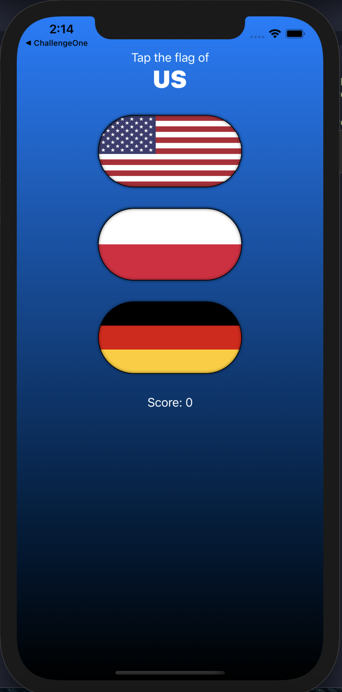

# 100-Days-of-SwiftUI
This repository contains the projects of the 100 Days Of SwiftUI by Paul Hudson.
| # | Project         | Topics Covered | Preview | Description |
| - | --------------- | -------------- | ------- | --------------- |
| 1 | WeSplit   | Form, Section, NavigationView, @State property wrapper, TextField, Picker, ForEach |  | iOS app for bill calculations |
| 2 | ChallengeOne   |  |  | iOS app for length conversions. |
| 3 | GuessTheFlag   | Button, VStack, Alert, Image |  | Guess the flag game |
| 4 | ViewsAndModifiers   | ViewModifier, View compositions, ViewContainer |  | Trying out custom ViewModifier |
| 5 | Rock, Paper, Scissors   | Milestone projects 1-3 |  | Rock, paper, scissors game |
| 6 | BetterRest   | CreateML, Stepper, DatePicker, DateComponents, DateFormatter, navigationBarItems() |  | App that uses ML to suggest bedtime |
| 7 | WordScramble   | List, onAppear, Bundle, fatalError(), UITextChecker |  | WordScramble game |
| 8 | MultiplicationTableEdutainment   | Milestone projects 4-6 |  | Multiplication Table practicing game |
| 9 | iExpense   | UserDefaults, Codable, sheet(), onDelete(), @ObservedObject, EditButton |  | Expense tracker app |