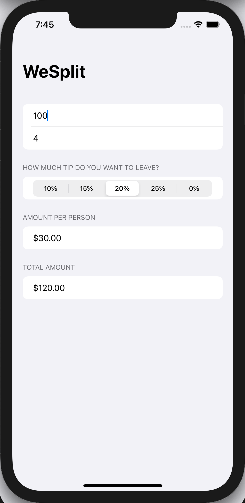

# WeSplit

## Description
This is the first project of the 100 Days Of SwiftUI by Paul Hudson. The app helps people to calculate how to split their bills, including tips.

## Topics covered
Form, Section, NavigationView, @State property wrapper, TextField, Picker, ForEach

## Screenshots

